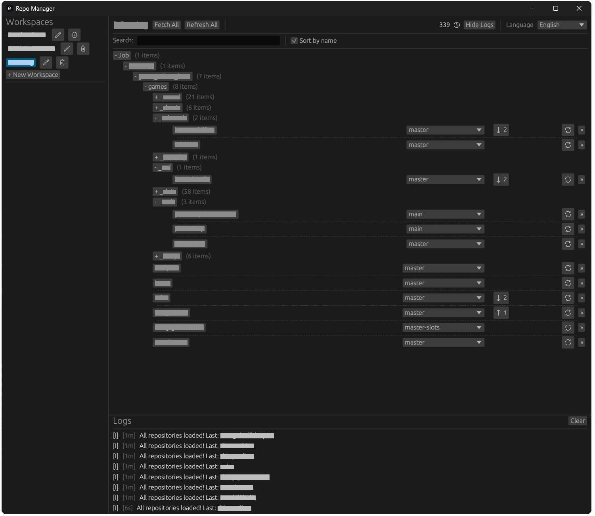

# Repo Manager

A minimalist Git repository manager built with Rust and egui for efficiently organizing and managing multiple repositories across different workspaces.



## Features

- 🗂️ **Workspace Organization** - Group repositories by projects or categories
- 🖱️ **Drag & Drop** - Add repositories by dragging folders into the application
- 🌳 **Tree View** - Hierarchical display of repository structure with collapsible folders
- 🔄 **Git Operations** - Quick fetch, pull, push, and branch switching
- 📊 **Status Indicators** - Visual feedback for uncommitted changes and sync status
- 🔍 **Search & Filter** - Find repositories quickly with built-in search
- 🌐 **Multilingual** - English and Russian interface support
- 💾 **Auto-save** - Configuration automatically saved between sessions
- 📱 **Cross-platform** - Windows, macOS, and Linux support

## Installation

### Prerequisites

- [Rust](https://rustup.rs/) (latest stable version)
- Git (available in PATH)

### Build from Source

```bash
# Clone the repository
git clone https://github.com/yourusername/repo-manager.git
cd repo-manager

# Build release version
cargo build --release

# The executable will be in target/release/
```

### macOS App Bundle

```bash
# Install cargo-bundle
cargo install cargo-bundle

# Create macOS .app bundle
cargo bundle --release

# App will be in target/release/bundle/osx/Repo Manager.app
```

## Usage

1. **Create Workspace** - Click "+ New Workspace" to organize your repositories
2. **Add Repositories** - Drag folders containing Git repositories into the window
3. **Manage Projects** - Use the tree view to navigate and organize your repositories
4. **Git Operations** - Click repository names to open in file explorer, use buttons for Git operations
5. **Switch Languages** - Use the language selector in the top-right corner

## Configuration

Settings are automatically saved to:
- **Windows**: `%APPDATA%\RepoManager\config.json`
- **macOS**: `~/Library/Application Support/RepoManager/config.json`
- **Linux**: `~/.config/RepoManager/config.json`

## Requirements

- Git must be installed and available in PATH
- Modern operating system (Windows 10+, macOS 10.11+, recent Linux)

## Development

```bash
# Run in development mode
cargo run

# Run tests
cargo test

# Check code
cargo check
```

## Built With

- [egui](https://github.com/emilk/egui) - Cross-platform GUI framework
- [gix](https://github.com/Byron/gitoxide) - Git implementation in Rust
- [tokio](https://tokio.rs/) - Async runtime
- [serde](https://serde.rs/) - Serialization framework

## License

This project is licensed under the Mozilla Public License Version 2.0 - see the [LICENSE](LICENSE) file for details.

## Contributing

Contributions are welcome! Please feel free to submit a Pull Request.